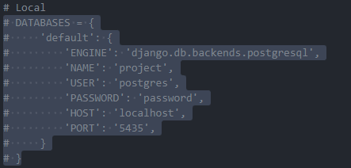

<div align="center">

# Opportunity


_Opportunity is a platform for managing vacancies on Campus IV, whose objective is to consolidate information regarding all available opportunities in a centralized manner, covering everything from scientific and technological initiation projects, extension and development projects, to internship vacancies. This initiative aims to simplify access to information, promoting integration between interested parties.._ <br>

<h1>Contributors</h1>
<!-- ALL-CONTRIBUTORS-LIST:START - Do not remove or modify this section -->
<!-- prettier-ignore-start -->
<!-- markdownlint-disable -->
<table>
  <tbody>
    <tr>
      <td align="center" valign="top" width="14.28%"><a href="https://www.linkedin.com/in/kawhan-laurindo-de-lima-b61a7a1b4/"><br /><sub><b>Kawhan Laurindo de Lima</b></sub></a><br /><a href="#code-Kawhan" title="Code">💻</a></td>
    </tr>
  </tbody>
</table>

<!-- markdownlint-restore -->
<!-- prettier-ignore-end -->

<!-- ALL-CONTRIBUTORS-LIST:END -->

## 📌 Features
```
1° Registration verification by email
2° Registration of CAMPUS IV vacancies
3° Check the interest of students on campus
4° analytical part of the system
```


## 🤖 Run project
1° Create virtual ambient <br/>
Windows use this tutorial: <a href="https://www.codingforentrepreneurs.com/guides/install-python-on-windows/">Tutorial</a> </br>
Ubuntu use this tutorial: <a href="https://www.codingforentrepreneurs.com/guides/install-python-on-windows/](https://www.digitalocean.com/community/tutorials/how-to-install-python-3-and-set-up-a-programming-environment-on-ubuntu-20-04-quickstart)https://www.digitalocean.com/community/tutorials/how-to-install-python-3-and-set-up-a-programming-environment-on-ubuntu-20-04-quickstart">Tutorial</a> <br/>

2° Install docker <br/>
Windows Docker Desktop: <a href="https://www.codingforentrepreneurs.com/guides/install-python-on-windows/](https://www.docker.com/products/docker-desktop/">Dowload</a> </br>
Ubuntu use this tutorial: <a href="https://docs.docker.com/engine/install/ubuntu/">Tutorial</a> <br/>

3° Env files<br/>

<ol align="left">
  <li>Before proceeding you need to hire someone system administrator so that you have access to the env containing additional information, the env was not added for security measure.</li>
  <li>Please speak to someone to contribute to gain access to the env</li>
</ol>


4° Configure project to start locally <br/>
<ol align="left">
  <li>In the project opportunities folder, you have a docker-compose file that contains information about the database, to run the project you need this image to be run:</li>
  
  <li>Run docker-compose up in same directory</li>
</ol>

5° Run the project <br/>
<ol align="left">
  <li>Activate the virtual environment, this information on how to activate the virtual environment can be accessed through this tutorial: <a href="https://ioflood.com/blog/python-activate-venv/#:~:text=Activating%20a%20virtual%20environment%20in%20Python%20is%20straightforward.,directory%20of%20your%20virtual%20environment.">Tutorial</a></li>
  <li>Install all dependencies using the command: pip install -r requirements.txt</li>
  <li>Start the project using the command: python manage.py runserver</li>
</ol>


</div>
